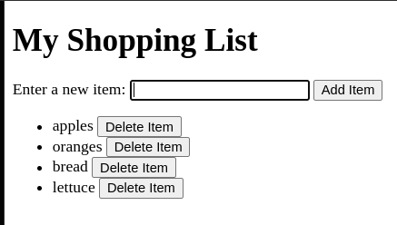

# Vanilla Grocery List

## Learning Objective:

Using HTML and vanilla JavaScript, make a shopping list. Consider methods for prioritizing accessibility.

## Prompt:

Using HTML and vanilla JavaScript, make a shopping list. Users should be able to enter the item into a text field and press a button to add the item to the list. The item should then appear on the list. Each item on the list should have a button to delete this list item. After pressing add item button the input field should clear and the cursor returns to the input field (focus). See example of complete Shopping List below.

